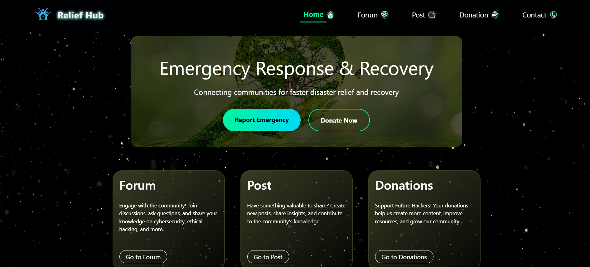
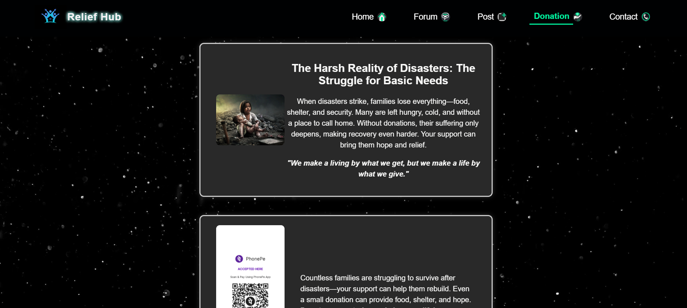

# 🌍 Relief-Hub: Disaster Relief & Community Support Platform

**Relief-Hub** is a web-based platform built to support communities affected by natural disasters and crises. It connects volunteers, donors, and victims by offering a centralized space for donations, communication, and real-time support.

---

## 🚀 Live Demo  
[](https://azeezafarhanashaik.github.io/relief-hub/)

---

## 📸 Screenshots

### 🏠 Homepage (index.html)


### 🤝 Donation Page (donations.html)


### 💬 Forum Page (forum.html)


### 📝 Posts Page (post.html)


### 📞 Contact Page (contact.html)


> Screenshots give a quick preview of the site's UI. All pages are mobile-responsive and user-friendly.

---

## 💖 Purpose

In times of disaster, coordination and help can save lives. Relief-Hub is designed to:

- Collect donations for affected communities  
- Allow victims to reach out for help  
- Enable volunteers and donors to collaborate  
- Share critical updates, resources, and safety tips  

---

## 📁 Project Structure

```plaintext
├── contact.html        # Contact page for reaching out to the support team  
├── donations.html      # Donation options for individuals and organizations  
├── forum.html          # Forum to discuss needs, updates, and community support  
├── index.html          # Homepage with overview and emergency resources  
├── post.html           # Page for blog posts or urgent announcements  
├── styles.css          # Styling for the entire website  
```
---
## 💡 Features

- **Centralized Emergency Communication:**  
  Easily broadcast urgent announcements, resource availability, and safety tips.

- **Community Forum:**  
  A space where victims, volunteers, and donors can interact, post needs, and offer help.

- **Donation Portal:**  
  Accepts support from individuals or organizations through structured donation options.

- **Informative Blog/Posts Section:**  
  Share updates, relief news, and stories to keep the community informed.

- **Responsive Design:**  
  Mobile-friendly layout ensures usability across all devices.

- **User-Friendly Interface:**  
  Simple and intuitive navigation for all age groups and literacy levels.

- **Contact Page:**  
  Get in touch with support teams or relief coordinators.

- **Open Source Contribution:**  
  Anyone can contribute to improve the platform and expand its reach.
